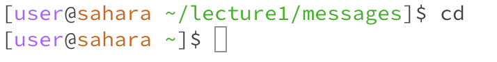
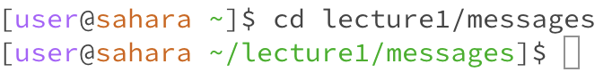
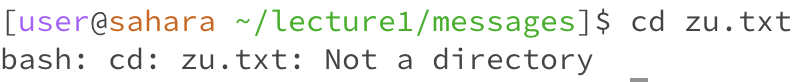

# `cd
## 1. Share an example of using the command with no arguments.

   
When I do cd to no command nothing happens.

   
When I do cd in a different directory the directory is changed to the home directory.
## 2. Share an example of using the command with a path to a directory as an argument.

  
When I put a path as an arguement the directory is changed to the path.
## 3. Share an example of using the command with a path to a file as an argument.

  
When I put a file as an arguement I get an error and there is output saying that the file isn't a directory.
# ls
## 1. Share an example of using the command with no arguments.
## 2. Share an example of using the command with a path to a directory as an argument.
## 3. Share an example of using the command with a path to a file as an argument.
# cat
## 1. Share an example of using the command with no arguments.
## 2. Share an example of using the command with a path to a directory as an argument.
## 3. Share an example of using the command with a path to a file as an argument.
