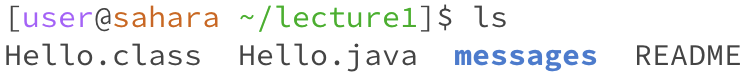
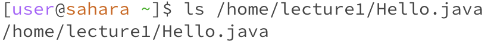
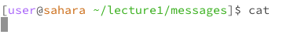
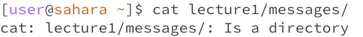
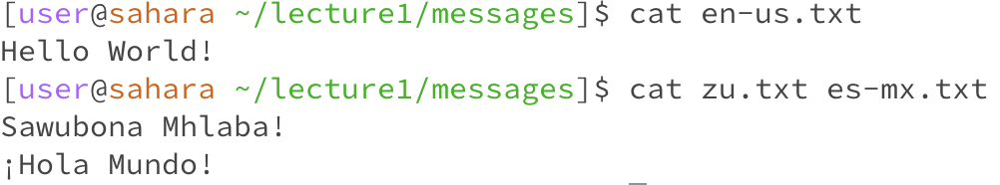

# ```cd```
## 1. cd with no arguments

 <br> 
When we run cd with no command nothing happens.

 <br> 
When we run cd in a different directory the directory is changed to the home directory.
## 2. cd with a path to a directory as an argument

<br> 
When I put a path as an arguement the directory is changed to the path.
## 3. cd with a path to a file as an argument

<br> 
When I put a file as an arguement I get an error and there is output saying that the file isn't a directory.
# ls
## 1. ls with no arguments

<br> 
When I type ls with no argueents it lists the folders and files in the working directory.
## 2. ls with a path to a directory as an argument

<br> 
Typing ls with a path to a directory as an arguement lists the folders and files in the path.
## 3. ls with a path to a file as an argument

<br> 
# cat
## 1. cat with no arguments

<br> 
## 2. cat with a path to a directory as an argument

<br> 
## 3. cat with a path to a file as an argument

<br> 
