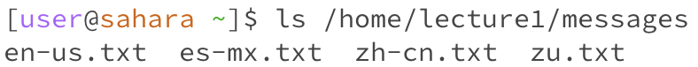

# ```cd```
## 1. ```cd``` with no arguments

 <br> 
The working directory is initially ```/home/lecture1/messages```. When we run ```cd``` the directory is changed to the home directory. This is not an error because what 
## 2. ```cd``` with a path to a directory as an argument

<br> 
The working directory is initially ```/home```. When we put a path to a directory as an arguement the directory is changed to the specified directory.
## 3. ```cd``` with a path to a file as an argument

<br> 
The working directory is initially ```/home/lecture1/messages```. When we put a file as an arguement we get an error since ```cd``` is used for changing directories.
# ```ls```
## 1. ```ls``` with no arguments

<br> 
The working directory is initially ```/home/lecture1```. When we type ```ls``` with no arguements it lists the folders and files in the working directory.
## 2. ```ls``` with a path to a directory as an argument

<br> 
The working directory is initially ```/home```. Typing ```ls``` with a path to a directory as an arguement lists the folders and files in the specified path.
## 3. ```ls``` with a path to a file as an argument

<br> 
The working directory is initially ```/home```. This results in an error because ```ls``` is used to list files and folders in a directory and a file does not contain files and folders.
# ```cat```
## 1. ```cat``` with no arguments

<br> 
The working directory is initially ```/home/lecture1/messages```. This results in an error since ```cat``` needs a file or files as an arguement to print the content of the files.
## 2. ```cat``` with a path to a directory as an argument

<br> 
The working directory is initially ```/home```. Typing a path to a directory as an arguement results in an error. This results in an error because ```cat``` prints contents of files, and directories aren't files.
## 3. ```cat``` with a path to a file as an argument

<br> 
The working directory is initially ```/home/lecture1/messages```. Entering one file as an arguement just displays the contents of the file. When putting two files as the arguement the contents of both files are displayed.
