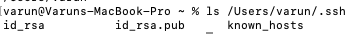
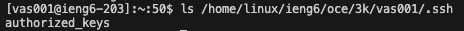

# Part 1
## Code for ChatServer
```
import java.io.IOException;
import java.net.URI;
import java.util.ArrayList;

class Handler implements URLHandler {
    // The one bit of state on the server: a number that will be manipulated by
    // various requests.
    String messages  =  "";

    public String handleRequest(URI url) {
        if (url.getPath().equals("/add-message")) {
            String[] parameters = url.getQuery().split("&"); 
            String[] getMessage = parameters[0].split("=");
            String[] getUser = parameters[1].split("=");            
            String message = null;

            if (getMessage[0].equals("s")) {
                message = getMessage[1];
            }
            if(getUser[0].equals("user")){
                message = getUser[1] + ": " + message + "\n";
            }
            
            messages += message;
            return messages;
        } else {
            return "404 Not Found!";
        }
    }
}

class ChatServer{
    public static void main(String[] args) throws IOException {
        if(args.length == 0){
            System.out.println("Missing port number! Try any number between 1024 to 49151");
            return;
        }

        int port = Integer.parseInt(args[0]);

        Server.start(port, new Handler());
    }
}
```
## Screenshots

**1. Which methods in your code are called?**\
The ```main``` method is called when ```ChatServer``` is run. The method ```handleRequest``` is also called.\
**2. What are the relevant arguments to those methods, and the values of any relevant fields of the class?**\
The main method takes the port number as an arguement and if no arguement is typed in "Missing port number! Try any number between 1024 to 49151" is printed. Then a new server is started with that specific port. Then after this ```handleRequest``` is run and the url path is /add-message as seen in the screenshot. The values for the variable ```parameters``` is ```["s=Hello_Bob","user=Varun_Sharma"]```, and ```getMessage = ["s","Hello_Bob"]``` and ```getUser= ["user","Varun_Sharma"]```. Then the variable ```messages``` is updated from an empty String to "Varun_Sharma: Hello_Bob."  \
**3. How do the values of any relevant fields of the class change from this specific request? If no values got changed, explain why.**\
The value for ```messages``` gets changed from an empty string to "Varun_Sharma: Hello_Bob." No other values are changed because none of the other variables like ```parameters```, ```getMessage```, and ```getUser``` were initialized outside the method ```handleRequest```.

**1. Which methods in your code are called?**\
The method ```handleRequest``` is called. \
**2. What are the relevant arguments to those methods, and the values of any relevant fields of the class?**\
In ```handleRequest``` the url path path is still /add-message. The values for ```parameters``` is ```["s=Hello_Varun","user=Bob"]```, and ```getMessage = ["s","Hello_Varun"]``` and ```getUser= ["user","Bob"]```. Then ```messages``` is updated from "Varun_Sharma: Hello_Bob" to "Varun_Sharma: Hello_Bob" and "Bob: Hello_Varun" seperated by a line .\
**3. How do the values of any relevant fields of the class change from this specific request? If no values got changed, explain why.**\
The value for ```parameters```, ```getMessage```, and ```getUser``` are all changed to reflect the changed query as seen in the screenshot. The variable ```messages``` is updated  to include the new values of the query.
\
# Part 2
**The absolute path to the private key for your SSH key for logging into ieng6 (on your computer, an EdStem workspace, or on the home directory of the lab computer)**\
 \
**The absolute path to the public key for your SSH key for logging into ieng6 (this is the one you copied to your account on ieng6, so it should be a path on ieng6's file system)** \
 \
**A terminal interaction where you log into your ieng6 account without being asked for a password.**\

# Part 3
One thing I learned in week 2 was what the ```ssh``` command did. I learned that ssh established a secure connection to a remote machine. During the lab we used the ssh command to connect to the PCs in the basement.
