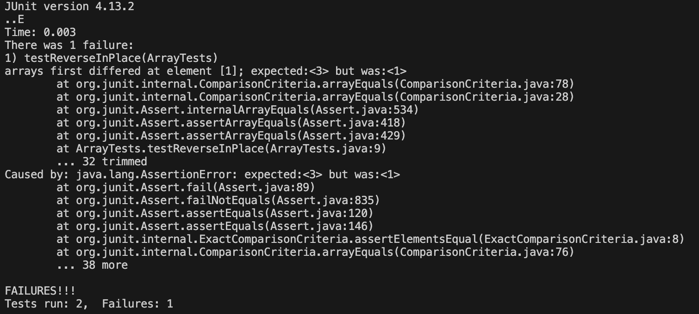

# Part 1 - Bugs
Here is the code for the test method for ```reverseInPlace``` that doesn't pass when I run it . The expected output after using ```reverseInPlace``` on ```input1``` is the reverse of the arrary of ```input1``` which is ```{ 1.3 }```. 
```
@Test 
public void testReverseInPlace() {
    int[] input1 = { 3,1 };
    ArrayExamples.reverseInPlace(input1);
    assertArrayEquals(new int[]{ 1,3 }, input1);
}
```
This test, however, passes:
```
@Test
  public void testReverseInPlace2() {
    int[] input1 = { 1 };
    ArrayExamples.reverseInPlace(input1);
    assertArrayEquals(new int[]{ 1 }, input1);
	}
```
The symptoms for testReverseInPlace and testReverseInPlace2 are:

As seen in the output, the test testReverseInPlace does not pass because we expected 3 and index 1 but 1 was actually at index 1. \
Here is the code with bugs for the ```reverseInPlace``` method.
```
static void reverseInPlace(int[] arr) {
    for(int i = 0; i < arr.length; i += 1) {
      arr[i] = arr[arr.length - i - 1];
    }
  }
```
Here is the code fixed:
```
static void reverseInPlace(int[] arr) {
    for(int i = 0; i < arr.length/2; i += 1) {
        int temp = arr[i];
        arr[i] = arr[arr.length - i - 1];
        arr[arr.length - i - 1] = temp;
    }
  }
```
The fix adresses the issue because in the code with bugs the code first correctly puts the last element at the first index however when it gets to the last index it copies the new first index to the last index. In the fixed code works because the for loop only traverses half the array and swithces the elements on either sides of the array.


# Part 2 - Researching Commands
## ```find -size examples```
**Example 1**
```
$ varun@Varuns-MacBook-Pro technical % find . -size +200k 
  ./government/About_LSC/commission_report.txt
  ./government/Env_Prot_Agen/bill.txt
  ./government/Gen_Account_Office/GovernmentAuditingStandards_yb2002ed.txt
  ./government/Gen_Account_Office/Statements_Feb28-1997_volume.txt
  ./government/Gen_Account_Office/d01591sp.txt
  ./911report/chapter-13.4.txt
  ./911report/chapter-13.5.txt
  ./911report/chapter-3.txt
```
Using the ```-size``` option for find allows us to search for files based on their size. In this example we are looking for files in the current directory (technical) for files that are more than 200 kilobytes in size. The ```+``` indicates more than and the ```k``` indicates kilobytes. This is useful if we want to look for a file you don't know the name of but know that is a large file. It is also useful to know which files take up a lot of space if you are trying to use the least amount of space for your project. 

**Example 2**
```
$ varun@Varuns-MacBook-Pro technical % find . -size -900c 
  .
  ./government
  ./government/About_LSC
  ./government/Env_Prot_Agen
  ./government/Alcohol_Problems
  ./government/Post_Rate_Comm
  ./plos/pmed.0020191.txt
  ./911report
  ./911report/empty.txt
```
In this example we are looking for files in the current directory (technical) for files that are less than 900 bytes in size. The ```-``` indicates less than and the ```c``` indicates bytes. This is useful if we want to look for a file that is small.
## ```find -empty examples```
**Example 1**
```
$ varun@Varuns-MacBook-Pro technical % find . -empty
  ./911report/empty.txt
```
This command searches the working directory technical and its subdirectories to look for an empty files or directories. In this example there is an empty file called empty.txt (which I created) in the 911report subdirectory of techincal. 

**Example 2**
```
$ varun@Varuns-MacBook-Pro technical % find ./biomed -empty
```
In this example find just searches the biomed subdirectory of technical for empty files or directories. Since there are no empty files or directories in biomed nothing is outputted by the command.
## ```find -type examples```
**Example 1**
```
$ varun@Varuns-MacBook-Pro technical % find . -type d
  .
  ./government
  ./government/About_LSC
  ./government/Env_Prot_Agen
  ./government/Alcohol_Problems
  ./government/Gen_Account_Office
  ./government/Post_Rate_Comm
  ./government/Media
  ./plos
  ./biomed
  ./911report
```
Using the ```-type``` option allows you to search for files based on their type. In this example we are searching the directory technical for other directories using the ```d```. The other subdirectories of techinical and their subdirectories are outputted. This is useful because you can get a good idea of all the directories you are working with. 

**Example 2**
```
$ varun@Varuns-MacBook-Pro technical % find ./government -type f 
  ./government/About_LSC/LegalServCorp_v_VelazquezSyllabus.txt
  ./government/About_LSC/Progress_report.txt
  ./government/About_LSC/Strategic_report.txt
  ./government/About_LSC/Comments_on_semiannual.txt
  ./government/About_LSC/Special_report_to_congress.txt
  ./government/About_LSC/CONFIG_STANDARDS.txt
  ./government/About_LSC/commission_report.txt
  ./government/About_LSC/LegalServCorp_v_VelazquezDissent.txt
  ./government/About_LSC/ONTARIO_LEGAL_AID_SERIES.txt
  ./government/About_LSC/LegalServCorp_v_VelazquezOpinion.txt
  ./government/About_LSC/diversity_priorities.txt
  ./government/About_LSC/reporting_system.txt
  ./government/About_LSC/State_Planning_Report.txt
  ./government/About_LSC/Protocol_Regarding_Access.txt
  ./government/About_LSC/ODonnell_et_al_v_LSCdecision.txt
  ./government/About_LSC/conference_highlights.txt
  ./government/About_LSC/State_Planning_Special_Report.txt
  ./government/Env_Prot_Agen/multi102902.txt
  ./government/Env_Prot_Agen/section-by-section_summary.txt
  ... more lines ...
```
In this example we are searching the directory government for files using ```f```. The files in government and its subdirectories are outputted. This is useful because you can check for all the files within a directory and its subdirectories and you can use this command with other commands such as name which makes it even more useful.
## ```find -cmin examples```
**Example 1**
```
$ varun@Varuns-MacBook-Pro technical % find . -cmin -3000
  ./government/About_LSC/Progress_report.txt
  ./911report
  ./911report/empty.txt
```
Using the ```-cmin``` option allows you to search for files that were created n minutes ago. In this example we are searching the directory technical and its subdirectories for files or directories created less than 3000 minutes ago which is indicated by ```-3000```. The  subdirectories of techinical and files are outputted that were created less than 3000 minutes ago. This is useful because you can see files you accessed recently or created recently.

**Example 2**
```
$ varun@Varuns-MacBook-Pro technical % find . -cmin -300 
  ./government/About_LSC/Progress_report.txt
```
In this example we are searching the directory technical and its subdirectories for files or directories created less than 300 minutes ago which is indicated by ```-300```. The  subdirectories of techinical and files are outputted that were created less than 300 minutes ago.
