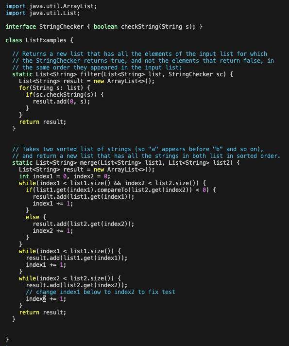

# 4.  Log into ieng6


Keys pressed: ```<up><enter>```  The ssh vas001@ieng6.ucsd.edu command was 1 up in the search history, so I used up arrow to access it
# 5. Clone your fork of the repository from your Github account (using the SSH URL)


Keys pressed: ```<Ctrl><r><v><a><s><enter>```I used Ctrl r and then typed vas to look in history for the ```git clone git@github.com:vas0011/lab7.git``` command.
# 6. Run the tests, demonstrating that they fail


Keys pressed: ```<cd><l><tab>```, ```<b><a><s><h><t><tab>``` I typed cd l and then did tab to autocomplete to ```cd ls```. Then I typed bash t and then tab to autocomplete to ```bash test.sh ```.
# 7. Edit the code file to fix the failing test


Keys pressed: ```<Ctrl><r><v><i><enter>```, ```<4><3><j><e><x><i><2><esc><shift><;><w><q><enter>``` I used Ctrl r to search history for the command ```vim ListExamples.java```. 




# 8. Run the tests, demonstrating that they now succeed


Keys pressed: ```<up><up><enter>```
# 9. Commit and push the resulting change to your Github account (you can pick any commit message!)

