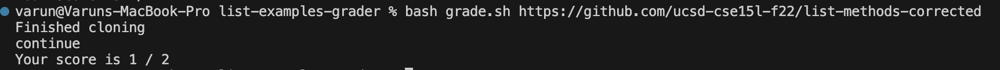
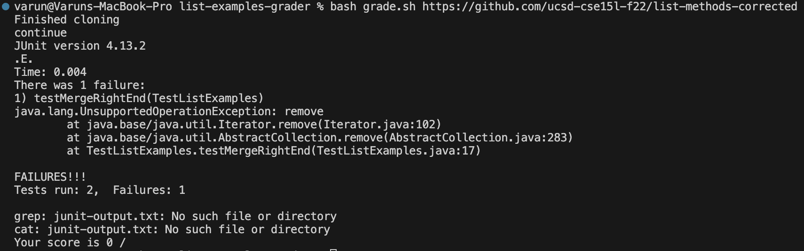

# Student Post
Hi TA, when I run my grading script on the code with the correct implementation for merge and filter I am getting a score of 1/2 instead of a score of 2/2. Please help me. I think my bash script looks correct, there might be something wrong with the tests I created. I just have a file called ```grade.sh``` and ```TestListExamples.java``` in the same directory.
Here is the output I got:

Here is the code for ```TestListExamples.java```:
```
import static org.junit.Assert.*;
import org.junit.*;
import java.util.Arrays;
import java.util.List;

class IsMoon implements StringChecker {
  public boolean checkString(String s) {
    return s.equalsIgnoreCase("moon");
  }
}

public class TestListExamples {
  @Test(timeout = 500)
  public void testMergeRightEnd() {
    List<String> left = Arrays.asList("a", "b", "c", "d");
    List<String> temp = left;
    temp.remove("d");
    List<String> right = temp; 
    List<String> merged = ListExamples.merge(left, right);
   List<String> expected = Arrays.asList("a", "a", "b", "b","c","c", "d");
    assertEquals(expected, merged);
  }

  @Test(timeout = 500)
  public void testFilter() {
    List<String> initial = Arrays.asList("a", "b", "moon", "c");
    List<String> actual = ListExamples.filter(initial, new IsMoon());
    List<String> expected = Arrays.asList("moon");
    assertEquals(expected, actual);
  }

}
```
Here is my code for ```grade.sh```:
```
CPATH='.:lib/hamcrest-core-1.3.jar:lib/junit-4.13.2.jar'

rm -rf student-submission
rm -rf grading-area

mkdir grading-area

git clone $1 student-submission 2> ta-output.txt
echo 'Finished cloning'


if ! [ -f student-submission/ListExamples.java ]
then 
    echo "Missing Necessary Files"
    exit
fi
echo "continue"

cp TestListExamples.java student-submission/ListExamples.java grading-area
cp -r lib grading-area

cd grading-area


javac -cp $CPATH *.java 2> java-compile.txt
if [ $? -ne 0 ]
then
    echo "Compilation Error"
    exit 1
fi

java -cp $CPATH org.junit.runner.JUnitCore TestListExamples > junit-output.txt

if grep -q "OK" junit-output.txt; 
then
    echo "Your score is 2/2"
else
    lastline=$(cat junit-output.txt | tail -n 2 | head -n 1)
    tests=$(echo $lastline | awk -F'[, ]' '{print $3}')
    failures=$(echo $lastline | awk -F'[, ]' '{print $6}')
    successes=$((tests - failures))
    echo "Your score is $successes / $tests"
fi


# Draw a picture/take notes on the directory structure that's set up after
# getting to this point

# Then, add here code to compile and run, and do any post-processing of the
# tests
```

# TA Response
Could you please include the output of the tests when you run ```grade.sh```.
# Student Response
Here is the output of the tests:

I changed this line in grade.sh: ```java -cp $CPATH org.junit.runner.JUnitCore TestListExamples > junit-output.txt``` to this ```java -cp $CPATH org.junit.runner.JUnitCore TestListExamples``` so I could see the output of the tests, without the output being redirected.
# TA Response
So from the output we can see that the error is from your ```testMergeRightEnd``` method. It seems like you were trying to create two lists where ```left``` had the values ```("a", "b", "c", "d")``` and ```right``` had the values ```("a", "b", "c")```. However, when you create the variable ```temp``` it still refers to the same ```left``` object so when you ```remove("d")``` it gets rid of ```d``` from the left list so ```left``` is now ```("a", "b", "c")```. When you assign ```right``` to ```temp```, ```right``` is ```("a", "b", "c")```. To fix this just assign ```right``` to ```Arrays.asList("a", "b", "c");```.
# Part 2 – Reflection
Something I learned this quarter was how to use the debugger. I found this really helpful because usually when I try to fix a bug in my code I just use print statements to find the values of variables at a specific point. However, using jdb to run the code makes it easier to see values of variables and gives me more information to allow me to catch the bug.

